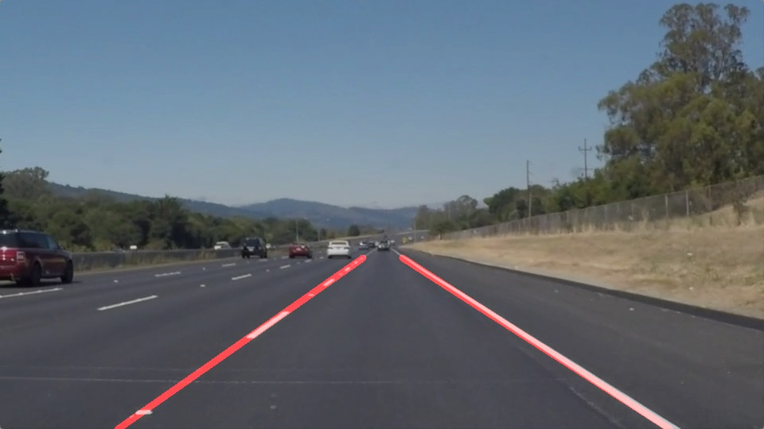

# Finding Lane Lines on the Road

## 1. Goal

Implement a computer vision pipeline to find lanes on the road. The pipeline should be applied to images and videos recorded from the frontal camera of a car.

**Initial image**:

**Final image**:

---

## 2. Pipeline

Pipeline is implemented in `find_lanes()` function and consists of 8 steps that use provided helper functions with some modifications:

1. Convert image to grayscale using `grayscale()`
2. Add gaussian blur to reduce contrast noise using `gaussian_blur()`
3. Detect edges using `canny()`
4. Mask region of interest (isosceles trapezoid) using `region_of_interest()`
5. Detecting lines with hough transform using `hough_lines()`. I modified the provided function to return lines instead of an image. These lines are used in the next step for extrapolation.
6. Splitting lines based on the slope to left and right lanes implemented in `extrapolate_lanes()`. Then fitting a line through points of the left and right lines seperately using `fit_line()` function, which I added to helper functions.
7. Draw lines using `draw_lines()`, which is modified to draw lines on a new image rather then modifying the provided one.
8. Overlay initial image with image with lines using `weighted_img()`

## 3. Parameters

Edge detection threshold were set to relatively high values, `70` and `160` since lanes usually have strong contrast with the road, although blurring does reduce the contrast.

Parameters for hough transform line detecter were modified to detect medium to long line segments and to avoid very short ones (noise), mostly by tweaking `threshold`, `min_line_length` and `max_ling_gap` parameters.

Splitting lines belonging to left and right lanes requires slope thresholds. In the current implementation `min_slope` is set to `0.5` and `max_slope` to `0.8` for the right lane. These values are negated for the left lane.

## 4. Shortcomings and possible improvements

The implemented pipline with tuned parameters performs well on all test images and two of the test videos. When comparing the outcome with the provided example, one noticable difference are minor changes in slope from frame to frame. The slope of frames in the example video change less frequently and smoother. Possible improvements to achive the same result:

1. Recalculate lanes every n-th frame instead of every frame.
2. Average lanes across last n frames. 
3. Implement tracking of lanes, searching for parameters near the ones in the previous frame.

The challenge video reveals several shortcomming of the current pipeline. There are several sources of contrasting edges in this video. One from the concrete median barrier, another one from front of the car and the third one from different road surfaces. These results in edges that are not part of lanes and need to be filtered out. In addition the road has a stepper curve, resulting in misalignment of the fitted line with the actual lanes. The following improvements might improve these issues:

1. Remove outliers (high residual error) when fitting a line
2. Implement tracking, averaging or majority voting across frames as suggested before.
3. Fit a curve instead of a line.
4. Use white and yellow stripes for segmentation.
